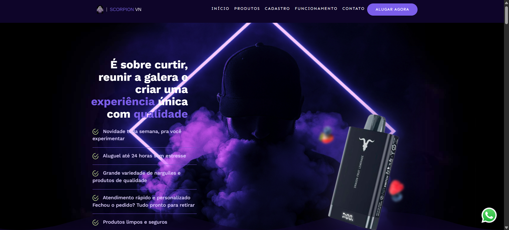

# Scorpion VN – Tabacaria & Headshop

Site institucional da tabacaria Scorpion VN com informações sobre produtos, modelos de narguiles, serviços e contatos. Publicado em [scorpionovo.netlify.app](https://scorpionovo.netlify.app)

## ✨ Funcionalidades

- Mostruário dos modelos de narguiles e acessórios disponíveis.
- Informações sobre locação de narguiles, headshop & bebidas.
- Layout responsivo, otimizado para mobile e desktop.
- Contato fácil via WhatsApp e redes sociais.
- Rodapé com disclaimers e links importantes.

## 🚀 Tecnologias

- HTML5
- CSS3 (com grid e responsividade)
- Bootstrap
- JavaScript (Swiper.js para sliders)
- JQuery
- [Netlify](https://www.netlify.com/) para deploy

## 📦 Como rodar localmente

1. Clone este repositório:
   git clone https://github.com/Feliipevasconcellos/site-scorpion-vn.git

2. Abra a pasta do projeto no seu editor.
3. Utilize uma extensão de servidor local ou abra o `index.html` diretamente no navegador.
4. (Opcional) Configure um servidor como [Live Server](https://marketplace.visualstudio.com/items?itemName=ritwickdey.LiveServer).

## 📲 Acesse online

O site está disponível em:  
https://scorpionovo.netlify.app

## 🤝 Contribuições

Sugestões e melhorias são bem-vindas!  
Abra uma _issue_ ou _pull request_ se quiser colaborar.

## ⚠️ Disclaimer

Este é um projeto institucional da Scorpion VN. Não somos afiliados a fabricantes de tabaco ou bebidas. O consumo de tabaco é restrito por lei – acesse apenas se for maior de idade.

---
